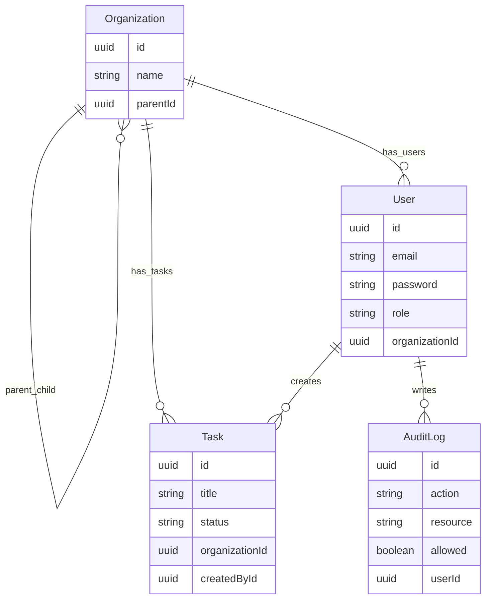

# Secure Task Management System

A production-ready Task Management System built with an Nx monorepo, NestJS backend, and Angular + TailwindCSS frontend. Features enterprise-grade security with cookie-based JWT authentication, comprehensive role-based access control (RBAC), organization hierarchy scoping, and action-driven UI refreshes.

## 📋 Table of Contents
- [Features](#features)
- [Monorepo Structure](#monorepo-structure)
- [Setup Instructions](#setup-instructions)
- [Security Architecture](#security-architecture)
- [UX Features](#ux-features)
- [Testing](#testing)
- [API Documentation](#api-documentation)
- [Architecture Decisions](#architecture-decisions)
- [Future Enhancements](#future-enhancements)
- [Data Model](#data-model)

<a id="features"></a>
## ✨ Features

### Security
- **HttpOnly Cookie Authentication**: JWT tokens stored in HttpOnly cookies for XSS protection
- **Role-Based Access Control (RBAC)**: Hierarchical permission system (Owner → Admin → Viewer)
- **Organization Scoping**: Multi-tenant architecture with parent-child organization support
- **Audit Logging**: Comprehensive audit trail for all RBAC decisions and task operations
- **CSRF Protection Ready**: Architecture prepared for CSRF token implementation

### User Experience
- **Action-Driven Updates**: Task list refreshes on create/update/delete and filter actions
- **Toast Notifications**: Contextual feedback for all user actions (success, error, warning, info)
- **Modal Dialogs**: Confirmation modals for destructive actions (delete)
- **Drag-and-Drop Interface**: Intuitive task management with status column transitions
- **Advanced Filtering**: Search, category, status, and sort options
- **Permission-Aware UI**: Role-based button visibility (Viewers see read-only interface)
- **Responsive Design**: Mobile-first TailwindCSS styling

### Code Quality
- **Comprehensive Test Coverage**: 56+ backend tests, extensive frontend test templates
- **Clean Architecture**: Separation of concerns with shared libraries
- **Type Safety**: End-to-end TypeScript with shared interfaces
- **Error Handling**: Global HTTP error interceptor with user-friendly messages

<a id="monorepo-structure"></a>
## 🏗️ Monorepo Structure

```
apps/
  api/              # NestJS backend with TypeORM
  ├── auth/         # JWT strategy, guards, controllers
  ├── tasks/        # Task CRUD with RBAC enforcement
  ├── audit-log/    # Audit logging service
  └── users/        # User management

  dashboard/        # Angular frontend with Tailwind
  ├── components/   # Reusable UI components (modals, toasts)
  ├── pages/        # Route components (login, dashboard)
  ├── services/     # HTTP clients, state management
  └── interceptors/ # Auth, error handling

libs/
  data/            # Shared TypeScript types and enums
  ├── entities.ts  # Task, User, Organization interfaces
  └── enums.ts     # Permissions, Roles, TaskStatus, TaskCategory

  auth/            # Reusable RBAC logic
  ├── permissions.ts        # Role-permission mapping with inheritance
  ├── decorators.ts         # @RequirePermissions decorator
  └── permissions.spec.ts   # Comprehensive permission tests
```

<a id="setup-instructions"></a>
## 🚀 Setup Instructions

### Prerequisites
- Node.js 20+
- npm 10+

### Install Dependencies
```sh
npm install
```

### Environment Configuration
Copy the example file and update values as needed:
```sh
cp .env.example .env  # Linux/Mac
copy .env.example .env  # Windows
```

`.env` values:
- `PORT` - API server port (default 3000)
- `JWT_SECRET` - JWT signing key (use strong random string in production)
- `DB_PATH` - sql.js database location name

### Run the Applications

#### Backend (NestJS API)
```sh
npx nx serve api
```
The API runs on `http://localhost:3000/api`.

#### Frontend (Angular Dashboard)
```sh
npx nx serve dashboard
```
The dashboard runs on `http://localhost:4200`.

### Seeded Test Accounts

| Role   | Email                 | Password     | Organization  |
|--------|-----------------------|--------------|---------------|
| Owner  | owner@acme.com        | password123  | ACME (parent) |
| Admin  | admin@acme.com        | password123  | ACME (parent) |
| Viewer | viewer@acme.com       | password123  | ACME (parent) |
| Admin  | admin@globex.com      | password123  | Globex (separate) |
| Viewer | viewer@subsidiary.com | password123  | Subsidiary (child of ACME) |

<a id="security-architecture"></a>
## 🔒 Security Architecture

### Cookie-Based Authentication (XSS Protection)

**Why HttpOnly Cookies?**
- `localStorage` is vulnerable to XSS attacks - any JavaScript can read tokens
- HttpOnly cookies cannot be accessed by client-side JavaScript
- Cookies are automatically sent with requests - no manual header management

**Implementation Details:**
```typescript
// Backend: Set HttpOnly cookie on login
response.cookie('accessToken', token, {
  httpOnly: true,                    // Prevents XSS access
  secure: process.env.NODE_ENV === 'production',  // HTTPS only in prod
  sameSite: 'strict',                // CSRF protection
  maxAge: 24 * 60 * 60 * 1000       // 24 hours
});

// Frontend: Automatic cookie sending
// All HTTP requests include withCredentials: true
this.http.get('/api/tasks', { withCredentials: true })
```

**Security Benefits:**
- ✅ Protection against XSS attacks
- ✅ Automatic CSRF protection with `sameSite: strict`
- ✅ Secure transmission with `secure` flag in production
- ✅ Session persistence across page refreshes
- ⚠️ Consider adding CSRF token for additional protection (see Future Enhancements)

### Role-Based Access Control (RBAC)

**Role Hierarchy with Inheritance:**
```
Owner (highest privilege)
  ↓ inherits all permissions from
Admin
  ↓ inherits all permissions from
Viewer (lowest privilege)
```

**Permission System:**
```typescript
// Base permissions per role
Viewer:  [TaskRead]
Admin:   [TaskCreate, TaskUpdate, TaskDelete, AuditRead]
Owner:   [UserManage, OrganizationManage]

// Effective permissions with inheritance
Viewer:  [TaskRead]
Admin:   [TaskRead, TaskCreate, TaskUpdate, TaskDelete, AuditRead]
Owner:   [TaskRead, TaskCreate, TaskUpdate, TaskDelete, AuditRead, UserManage, OrganizationManage]
```

**Permission Enforcement:**
```typescript
// Backend: Controller-level permission checks
@RequirePermissions(Permission.TaskCreate)
@UseGuards(JwtAuthGuard, RbacGuard)
create(@CurrentUser() user, @Body() dto) {
  return this.tasksService.createTask(user, dto);
}

// Backend: Service-level organization scoping
async updateTask(user, id, dto) {
  const task = await this.findOne(id);
  const allowedOrgs = await this.getAccessibleOrgs(user.organizationId);

  if (!allowedOrgs.includes(task.organizationId)) {
    this.auditLog({ userId: user.id, action: 'task:update', allowed: false });
    throw new ForbiddenException();
  }

  if (user.role === UserRole.Viewer) {
    this.auditLog({ userId: user.id, action: 'task:update', allowed: false });
    throw new ForbiddenException();
  }

  // Update task...
  this.auditLog({ userId: user.id, action: 'task:update', allowed: true });
}
```

### Organization Hierarchy

**Multi-Tenant Scoping:**
- Users can access tasks in their own organization
- Users in parent organizations can access child organization tasks
- Users in child organizations CANNOT access parent organization tasks
- Cross-organization access is strictly forbidden

**Example:**
```
ACME (parent org)
├── Subsidiary A (child)
└── Subsidiary B (child)

Globex (separate org)

Access Rules:
- owner@acme.com can see: ACME, Subsidiary A, Subsidiary B tasks
- viewer@subsidiary.com can see: Subsidiary A tasks only
- admin@globex.com can see: Globex tasks only (no ACME access)
```

### Audit Logging

All permission checks and task operations are logged:
```typescript
{
  userId: 'user-123',
  action: 'task:update',
  resource: 'task:456',
  allowed: true,
  timestamp: '2025-01-01T12:00:00Z'
}
```

Audit logs capture:
- ✅ Successful operations
- ✅ Failed permission checks
- ✅ Cross-organization access attempts
- ✅ Viewer role attempting create/update/delete

<a id="ux-features"></a>
## 🎨 UX Features

Concise UX features for the dashboard:
- Toast notifications for success/error/info feedback.
- Reusable modals for edit and destructive confirmations.
- Drag-and-drop task workflow with filters and search.
- Permission-aware UI (view-only for Viewers).
- Task list refreshes on user actions (create/update/delete and filter changes).

<a id="testing"></a>
## 🧪 Testing

### Backend Tests (Jest)

**Run Tests:**
```sh
npx nx test api                    # Run all backend tests
npx nx test api --coverage         # With coverage report
```

**Test Coverage:**
- ✅ **56 tests passing**
- ✅ TasksService (create, read, update, delete, filtering, org scoping)
- ✅ TasksController (delegation, query param handling)
- ✅ RbacGuard (permission checks, audit logging, role hierarchy)
- ✅ AuthService (login, logout, password validation)
- ✅ Permission system (role inheritance, permission mapping)
- ✅ E2E tests (authentication, RBAC, cross-org access, filtering)

**Key Test Scenarios:**
```typescript
// Permission enforcement
it('should deny Viewer from creating tasks (403)', async () => {
  await request(app).post('/api/tasks')
    .set('Authorization', `Bearer ${viewerToken}`)
    .send({ title: 'Test' })
    .expect(403);
});

// Organization scoping
it('should prevent access to different org tasks', async () => {
  await request(app).put(`/api/tasks/${acmeTask.id}`)
    .set('Authorization', `Bearer ${globexToken}`)
    .send({ title: 'Hack' })
    .expect(403);
});

// Role inheritance
it('should allow Owner to access all Admin permissions', () => {
  expect(hasPermission(UserRole.Owner, Permission.TaskCreate)).toBe(true);
  expect(hasPermission(UserRole.Owner, Permission.TaskUpdate)).toBe(true);
  expect(hasPermission(UserRole.Owner, Permission.AuditRead)).toBe(true);
});
```

### Frontend Tests (Jest)

**Run Tests:**
```sh
npx nx test dashboard
```

**Coverage Areas:**
- ✅ dashboard.component.spec.ts (form validation, modals, filters)
- ✅ auth.service.spec.ts (cookie auth, session restoration)
- ✅ tasks.service.spec.ts (HTTP calls, error handling)
- ✅ modal.component.spec.ts (backdrop, ESC key, content projection)
- ✅ toast-container.component.spec.ts (rendering, dismissal)
- ✅ toast.service.spec.ts (lifecycle, auto-dismiss)
- ✅ confirmation-modal.component.spec.ts (danger styling, events)

### Manual Testing Guide

See [TESTING.md](./TESTING.md) for comprehensive manual testing scenarios including:
- Authentication flows
- RBAC permission testing per role
- Organization scoping validation
- UX feature testing (modals, toasts, drag-drop)
- Security validation (XSS protection, CSRF)

<a id="api-documentation"></a>
## 📚 API Documentation

### Authentication

#### POST `/api/auth/login`
**Request:**
```json
{
  "email": "owner@acme.com",
  "password": "password123"
}
```

**Response:**
```json
{
    "user": {
        "id": "ae3d867c-7053-4040-9a52-fd78f7f1cd3d",
        "name": "Owner User",
        "email": "owner@acme.com",
        "role": "Owner",
        "organizationId": "8243aa20-936e-4c0f-821d-b71df4ecd132"
    }
}
```
**Note:** JWT token is set in HttpOnly cookie (not in response body)

#### POST `/api/auth/logout`
Clears the authentication cookie and logs out the user.

#### GET `/api/auth/me`
Returns the current authenticated user (for session restoration on app load).

### Tasks

#### GET `/api/tasks`
**Query Parameters:**
- `category` - Filter by category (Work, Personal)
- `status` - Filter by status (Todo, InProgress, Done)
- `search` - Full-text search in task titles
- `sort` - Sort by field (order, title, status)

**Response:**
```json
[
  {
        "id": "21989c63-49fd-4e0b-9055-cc59ec606783",
        "title": "Update onboarding docs",
        "description": "Refresh guidance for new hires.",
        "category": "Work",
        "status": "Done",
        "order": 0,
        "organizationId": "0ad1dc47-d563-4d77-be1d-ffa2a8af8cb6",
        "createdById": "90c24699-5392-495b-9606-e36222bd76dd"
    }
]
```

#### POST `/api/tasks`
**Permission:** `task:create` (Admin, Owner)

**Request:**
```json
{
  "title": "New Task",
  "description": "Optional description",
  "category": "Work",
  "status": "Todo",
  "order": 0
}
```
**Response:**
```json
[
    {
      "id": "0f5009db-679d-4871-9edd-ffed5d190b1a",
      "title": "New Task",
      "description": "Optional description",
      "category": "Work",
      "status": "Todo",
      "order": 0,
      "organizationId": "8243aa20-936e-4c0f-821d-b71df4ecd132",
      "createdById": "ae3d867c-7053-4040-9a52-fd78f7f1cd3d"
  }
]
```
#### PUT `/api/tasks/:id`
**Permission:** `task:update` (Admin, Owner)

**Request:**
```json
{
  "title": "Updated Title",
  "status": "Done"
}
```
**Response:**
```json
[
  {
      "id": "0f5009db-679d-4871-9edd-ffed5d190b1a",
      "title": "Updated Title",
      "description": "Optional description",
      "category": "Work",
      "status": "Done",
      "order": 0,
      "organizationId": "8243aa20-936e-4c0f-821d-b71df4ecd132",
      "createdById": "ae3d867c-7053-4040-9a52-fd78f7f1cd3d"
  }
]
```

#### DELETE `/api/tasks/:id`
**Permission:** `task:delete` (Admin, Owner)
**Response:**
```json
[
  {
    "deleted": true
}
]
```
### Audit Log

#### GET `/api/audit-log`
**Permission:** `audit:read` (Admin, Owner)
**Response:**
```json
[
    {
        "userId": "ae3d867c-7053-4040-9a52-fd78f7f1cd3d",
        "action": "GET /api/audit-log",
        "resource": "rbac",
        "allowed": true,
        "id": "baf3d037-5ef7-4a09-9fb8-3930ad4c172b",
        "timestamp": "2026-02-09T18:08:50.318Z"
    },
    {
        "userId": "ae3d867c-7053-4040-9a52-fd78f7f1cd3d",
        "action": "task:delete",
        "resource": "task:undefined",
        "allowed": true,
        "id": "8060d56e-ae74-42bd-ac45-e600ec380df3",
        "timestamp": "2026-02-09T18:07:52.281Z"
    },
    {
        "userId": "ae3d867c-7053-4040-9a52-fd78f7f1cd3d",
        "action": "DELETE /api/tasks/0f5009db-679d-4871-9edd-ffed5d190b1a",
        "resource": "rbac",
        "allowed": true,
        "id": "85439fef-b317-4079-8f33-8322693a50c5",
        "timestamp": "2026-02-09T18:07:52.256Z"
    },
    {
        "userId": "ae3d867c-7053-4040-9a52-fd78f7f1cd3d",
        "action": "task:update",
        "resource": "task:0f5009db-679d-4871-9edd-ffed5d190b1a",
        "allowed": true,
        "id": "9b64fb95-91dd-4353-99b2-d779c2215a52",
        "timestamp": "2026-02-09T18:01:03.448Z"
    },
    {
        "userId": "ae3d867c-7053-4040-9a52-fd78f7f1cd3d",
        "action": "PUT /api/tasks/0f5009db-679d-4871-9edd-ffed5d190b1a",
        "resource": "rbac",
        "allowed": true,
        "id": "6bd86bde-f64e-4e28-b014-b5d85a934f24",
        "timestamp": "2026-02-09T18:01:03.361Z"
    },
    {
        "userId": "ae3d867c-7053-4040-9a52-fd78f7f1cd3d",
        "action": "task:create",
        "resource": "task:0f5009db-679d-4871-9edd-ffed5d190b1a",
        "allowed": true,
        "id": "ef18e595-3c6a-454a-b626-f4c0436959c0",
        "timestamp": "2026-02-09T17:51:33.544Z"
    },
    {
        "userId": "ae3d867c-7053-4040-9a52-fd78f7f1cd3d",
        "action": "POST /api/tasks",
        "resource": "rbac",
        "allowed": true,
        "id": "d409beec-7bb1-428d-9c2c-5e0625c18a41",
        "timestamp": "2026-02-09T17:51:33.478Z"
    },
    {
        "userId": "ae3d867c-7053-4040-9a52-fd78f7f1cd3d",
        "action": "POST /api/tasks",
        "resource": "rbac",
        "allowed": true,
        "id": "139ab273-d2c4-4f92-9636-2ec6162241c9",
        "timestamp": "2026-02-09T17:50:19.628Z"
    },
    {
        "userId": "ae3d867c-7053-4040-9a52-fd78f7f1cd3d",
        "action": "GET /api/tasks",
        "resource": "rbac",
        "allowed": true,
        "id": "1bb875f3-3ee8-495a-b29c-400437cc8c3f",
        "timestamp": "2026-02-09T17:48:42.423Z"
    }
]
```

Returns audit log entries with access decisions and timestamps.

<a id="architecture-decisions"></a>
## 🏛️ Architecture Decisions

### Why HttpOnly Cookies Over localStorage?

**Security Considerations:**
| Approach | XSS Protection | CSRF Risk | Implementation |
|----------|----------------|-----------|----------------|
| localStorage | ❌ Vulnerable | ✅ None | Simple |
| HttpOnly Cookies | ✅ Protected | ⚠️ Requires mitigation | Medium |

**Decision:** HttpOnly cookies for production-grade XSS protection. CSRF mitigation via `sameSite: strict` and future token implementation.

### Why Action-Driven Refresh Over Polling?

**Tradeoffs:**
| Approach | Complexity | Scalability | Real-Time | Infrastructure |
|----------|------------|-------------|-----------|----------------|
| Action-driven refresh | Low | Good | User-triggered | HTTP only |
| Polling | Medium | Good | Near real-time | HTTP only |
| WebSockets | High | Requires infrastructure | True real-time | WebSocket server |

**Decision:** Action-driven refresh for MVP simplicity and lower network usage. WebSocket/SSE recommended for true real-time updates.

### Why Role Inheritance?

**Benefits:**
- DRY Principle: Define permissions once, inherit up the chain
- Maintainability: Adding permissions to Admin automatically gives them to Owner
- Scalability: Easy to add new roles in the future
- Clarity: Explicit role hierarchy (Viewer → Admin → Owner)

**Implementation:**
```typescript
BASE_ROLE_PERMISSIONS = {
  Viewer: [TaskRead],
  Admin: [TaskCreate, TaskUpdate, TaskDelete, AuditRead],
  Owner: [UserManage, OrganizationManage]
};

ROLE_HIERARCHY = {
  Admin: Viewer,  // Admin inherits from Viewer
  Owner: Admin    // Owner inherits from Admin
};
```

### Why sql.js Instead of PostgreSQL?

**Tradeoffs:**
- ✅ Zero setup (no database installation)
- ✅ Cross-platform compatibility
- ✅ Fast for development and demos
- ⚠️ Not suitable for production (in-memory only)
- ⚠️ No concurrent write support

**Decision:** sql.js for assessment convenience. Production should use PostgreSQL/MySQL with TypeORM.

### Why Nx Monorepo?

**Benefits:**
- Shared code between frontend and backend (types, enums)
- Single `npm install` for entire project
- Consistent build/test tooling
- Clear separation of concerns with libraries
- Scalable to microservices architecture

<a id="data-model"></a>
## 🧩 Data Model

### Schema Overview
- **Organization**: tenant boundary with optional parent-child hierarchy.
- **User**: belongs to an organization and has a role (Owner/Admin/Viewer).
- **Task**: belongs to an organization and is created by a user.
- **AuditLog**: captures access decisions and task operations.

### ERD (conceptual)


<a id="future-enhancements"></a>
## 🚀 Future Enhancements

### Security
- [ ] **JWT Refresh Tokens**: Implement token rotation for long-lived sessions
- [ ] **CSRF Token**: Add synchronizer token pattern for additional CSRF protection
- [ ] **Advanced Role Delegation**: Time-bound or scoped permission grants
- [ ] **Rate Limiting**: Prevent brute-force attacks on login endpoint
- [ ] **Password Hashing**: Use Argon2 instead of bcrypt (more memory-hard)
- [ ] **2FA/MFA**: Add two-factor authentication support

### Performance
- [ ] **WebSocket/SSE**: Replace polling with real-time push notifications
- [ ] **Redis Caching**: Cache permission checks and frequently accessed data
- [ ] **Database Connection Pooling**: Optimize TypeORM connections
- [ ] **CDN Integration**: Serve static assets from CDN

### Features
- [ ] **Task Comments**: Add comment threads to tasks
- [ ] **File Attachments**: Upload files to tasks
- [ ] **Task History**: Track all changes to tasks
- [ ] **Advanced Filtering**: Date ranges, assignee, priority
- [ ] **Notifications**: Email/push notifications for task updates
- [ ] **Dark Mode**: User-selectable dark theme
- [ ] **Keyboard Shortcuts**: Power-user productivity features
- [ ] **Charts/Analytics**: Task completion trends, burndown charts

### DevOps
- [ ] **Docker Compose**: Containerized development environment
- [ ] **CI/CD Pipeline**: Automated testing and deployment
- [ ] **Monitoring**: Application performance monitoring (APM)
- [ ] **Logging**: Structured logging with ELK stack
- [ ] **Database Migrations**: Automated schema versioning

## 📄 License

MIT

## 🤝 Contributing

This is an assessment project. For production use, please fork and adapt to your needs.

---
